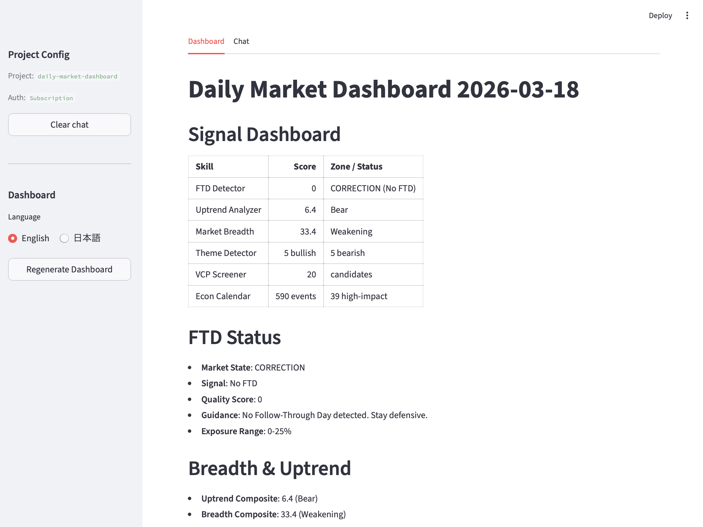
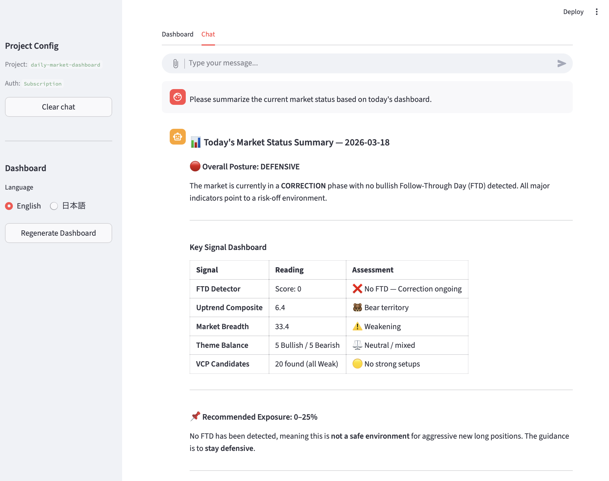

# Daily Market Dashboard

A sample agent application that combines 5 trading skills into a unified daily market dashboard, powered by **Streamlit** and **Claude Agent SDK**.

> **[日本語はこちら](#daily-market-dashboard-日本語)**

## What It Does

1. **Dashboard Tab** — Auto-generated market overview from 5 skills running in parallel
2. **Chat Tab** — Ask questions about the dashboard data; the market-advisor agent provides context-aware analysis




### Skills Used

| Skill | What It Measures |
|-------|-----------------|
| FTD Detector | Follow-Through Day signals for market bottom confirmation |
| Uptrend Analyzer | Market breadth uptrend composite score (0-100) |
| Market Breadth Analyzer | Broad market participation composite score (0-100) |
| Theme Detector | Bullish/bearish sector themes with lifecycle stages |
| VCP Screener | Volatility Contraction Pattern breakout candidates |

> **Note**: Market Top Detector and Economic Calendar are excluded from automated generation because they require interactive execution. Use `/market-top-detector` or `/economic-calendar-fetcher` in the Chat tab instead.

## Prerequisites

- Python 3.11+
- [Claude Agent SDK](https://docs.anthropic.com/en/docs/agent-sdk) (`pip install claude-agent-sdk`)
- Anthropic API key **or** Claude subscription (logged in via `claude` CLI)
- **No API keys required** — 3 of 5 skills (Uptrend, Breadth, Theme) use public data only; FTD Detector and VCP Screener show N/A without `FMP_API_KEY` (optional, free tier sufficient)
- Third-party Python packages (installed via `requirements.txt`): `requests`, `pandas`, `numpy`, `yfinance`, `finvizfinance`, `beautifulsoup4`, `lxml`, `pyyaml`

## Quick Start

```bash
cd examples/daily-market-dashboard

# Install dependencies
pip install -r requirements.txt

# (Optional) Configure API keys
cp .env.example .env
# Edit .env — ANTHROPIC_API_KEY is optional if using Claude subscription

# Generate today's dashboard
python3 generate_dashboard.py --project-root ../..

# Generate in Japanese
python3 generate_dashboard.py --project-root ../.. --lang ja

# Launch the app
streamlit run app.py
```

## Features

- **Language Selection** — Switch between English and Japanese via the sidebar radio button before regenerating the dashboard
- **Dashboard + Chat Tabs** — View the latest dashboard directly, or switch to Chat for interactive Q&A
- **Regenerate Button** — One-click dashboard refresh from the sidebar (runs all 5 skills in ~80s)
- **Knowledge-Aware Chat** — The agent automatically searches `knowledge/` for relevant dashboard data
- **Auto-Cleanup** — Dashboards older than 3 days are automatically removed

## Scheduled Execution (macOS)

```bash
cd examples/daily-market-dashboard

# Ensure logs directory exists
mkdir -p logs

# Install and load launchd agent
sed "s|\$HOME|$HOME|g; s|\$REPO_ROOT|$(cd ../.. && pwd)|g; s|\$PROJECT_DIR|$(pwd)|g" \
  launchd/com.trading.daily-dashboard.plist > ~/Library/LaunchAgents/com.trading.daily-dashboard.plist
launchctl load ~/Library/LaunchAgents/com.trading.daily-dashboard.plist
```

Runs `generate_dashboard.py` daily at 6:30 AM. Logs are written to `logs/`.

## Directory Structure

```
daily-market-dashboard/
├── app.py                         # Streamlit UI (Dashboard + Chat tabs)
├── generate_dashboard.py          # 5-skill parallel runner + markdown generator
├── agent/                         # Claude Agent SDK client (from template)
├── config/                        # App settings (title, icon, model)
├── knowledge/                     # Auto-generated daily_dashboard_YYYY-MM-DD.md
├── assets/                        # Screenshots for README
├── .claude/
│   ├── agents/market-advisor.md   # Market advisor persona
│   ├── settings.json              # Permission configuration
│   └── skills -> ../../../skills/ # Symlink to trading skills
├── scripts/                       # Agent-created user scripts (sandboxed)
├── logs/                          # launchd execution logs
├── .env.example
├── .mcp.json
├── .streamlit/config.toml
├── requirements.txt
├── launchd/                       # macOS scheduled execution
├── CLAUDE.md                      # Agent coding guidelines
└── README.md
```

---

# Daily Market Dashboard (日本語)

Streamlit と Claude Agent SDK を活用した、5つのトレーディングスキルを統合するデイリーマーケットダッシュボードのサンプルアプリケーションです。

## 概要

1. **ダッシュボードタブ** — 5スキルを並行実行して生成した市場概況を表示
2. **チャットタブ** — ダッシュボードデータについて AI アドバイザーに質問・相談

### 使用スキル

| スキル | 測定内容 |
|--------|----------|
| FTD Detector | フォロースルーデー（市場底値確認シグナル） |
| Uptrend Analyzer | 上昇トレンド総合スコア (0-100) |
| Market Breadth Analyzer | 市場の広がり総合スコア (0-100) |
| Theme Detector | 強気/弱気セクターテーマとライフサイクル分析 |
| VCP Screener | ボラティリティ収縮パターン候補銘柄 |

> **注記**: Market Top Detector と Economic Calendar はインタラクティブな実行が必要なため、自動生成対象外です。チャットタブで `/market-top-detector` や `/economic-calendar-fetcher` を実行してください。

## 必要環境

- Python 3.11+
- [Claude Agent SDK](https://docs.anthropic.com/en/docs/agent-sdk)
- Anthropic API キー **または** Claude サブスクリプション（`claude` CLI でログイン済み）
- **API キー不要** — 3スキル (Uptrend, Breadth, Theme) は公開データのみ。FTD Detector と VCP Screener は `FMP_API_KEY` なしでは N/A 表示（任意、無料枠で十分）
- サードパーティ Python パッケージ（`requirements.txt` で一括インストール）: `requests`, `pandas`, `numpy`, `yfinance`, `finvizfinance`, `beautifulsoup4`, `lxml`, `pyyaml`

## クイックスタート

```bash
cd examples/daily-market-dashboard

# 依存パッケージのインストール
pip install -r requirements.txt

# (任意) API キーを設定
cp .env.example .env
# Claude サブスクリプション利用の場合、ANTHROPIC_API_KEY は省略可

# ダッシュボード生成（英語）
python3 generate_dashboard.py --project-root ../..

# ダッシュボード生成（日本語）
python3 generate_dashboard.py --project-root ../.. --lang ja

# アプリ起動
streamlit run app.py
```

## 主な機能

- **言語切替** — サイドバーのラジオボタンで English / 日本語 を選択してダッシュボードを再生成
- **Dashboard + Chat タブ** — 最新ダッシュボードの直接閲覧と、対話型 Q&A の切替
- **ワンクリック再生成** — サイドバーの「ダッシュボード再生成」ボタンで全5スキルを実行（約80秒）
- **ナレッジ連携チャット** — エージェントが `knowledge/` 内のダッシュボードデータを自動検索して回答
- **自動クリーンアップ** — 3日以上前のダッシュボードを自動削除

## 定時実行 (macOS)

```bash
cd examples/daily-market-dashboard

# logs ディレクトリを作成
mkdir -p logs

# launchd エージェントをインストール
sed "s|\$HOME|$HOME|g; s|\$REPO_ROOT|$(cd ../.. && pwd)|g; s|\$PROJECT_DIR|$(pwd)|g" \
  launchd/com.trading.daily-dashboard.plist > ~/Library/LaunchAgents/com.trading.daily-dashboard.plist
launchctl load ~/Library/LaunchAgents/com.trading.daily-dashboard.plist
```

毎朝 6:30 に `generate_dashboard.py` を自動実行します。ログは `logs/` に出力されます。
